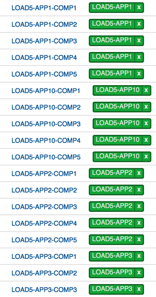
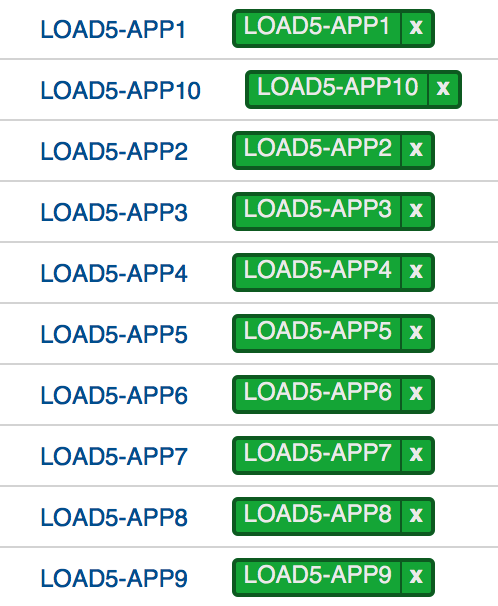

##ucd-stress-test
This utility can be used to setup your UrbanCode Deploy environment for performance testing. Since realistic scalability testing of UrbanCode Deploy can be difficult due to lab constraints and is simply not possible in production environments, this utility can help to set baseline performance expectations in your infrastructure. [Docker](http://docker.io) is very helpful for testing purposes in this case and is mentioned a few times here.

There are two main parts to this utility:

1. A shell script that takes input, creates a set of applications and components, creates a version and artifact for each component, then calls a Java program. The shell scripts prompts for:
  - External User URL for UrbanCode Deploy
  - Username and password
  - Number of applications to create
  - Number of components to create per application

2. A Java program which creates a resource tree structure with groups for each application, then maps each generated component to its own agent in the resource tree.

There is risk of polluting your UrbanCode Deploy server since the utility creates applications, components, resources, and tags so it may be worth setting up an ephemeral implementation for testing.

  

####About Agents
The Java program looks for agents with a specific naming convention. By default, that pattern is `agentn` where *n* is a six-digit integer representing the agent number (i.e. 000001). The Java program creates a resource structure where each component is mapped to a unique agent. This means there is a 1:1 relationship between total number of components generated and the number of agents required for the utility to run successfully.

You can start several agents on a single host using Docker and [stackinabox](http://stackinabox.io). For example:
```
docker run -d -e DEPLOY_SERVER_URL=https://<HOSTNAME>:<PORT> -e AGENT_NAME=agent000001 -e DEPLOY_SERVER_HOSTNAME=<HOSTNAME> --name agent000001 stackinabox/urbancode-deploy-agent:6.2.2.0.819509
```


####Required JARs
These libraries must be copied over from an UrbanCode Deploy installation:
```
log4j.jar
HttpComponents-Util.jar
udclient.jar
```
Download the libs from Maven [here for log4j](https://mvnrepository.com/artifact/log4j/log4j) and [here for the others](https://public.dhe.ibm.com/software/products/UrbanCode/maven2/).

####To build:
```
ant dist-main
```

####To run:
```
chmod +x create-apps.sh
./create-apps.sh
```
